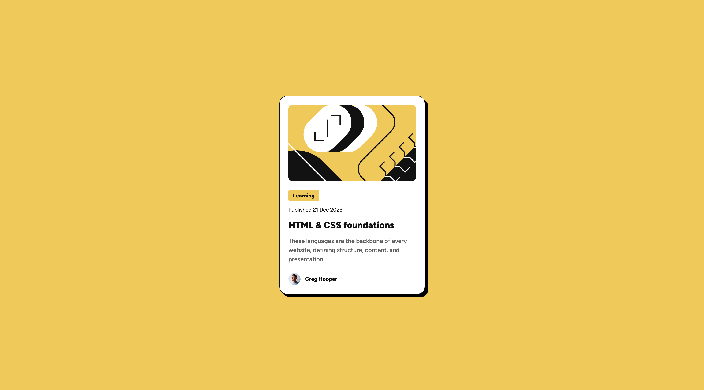

# Frontend Mentor - Blog preview card solution

This is a solution to the [Blog preview card challenge on Frontend Mentor](https://www.frontendmentor.io/challenges/blog-preview-card-ckPaj01IcS). This project is an opportunity to improve my AI-driven development skills.

## Table of contents

- [Overview](#overview)
  - [Screenshot](#screenshot)
  - [Links](#links)
- [My process](#my-process)
  - [Built with](#built-with)
  - [What I learned](#what-i-learned)
  - [Extra feature](#extra-feature)
  - [AI Collaboration](#ai-collaboration)

## Overview

The challenge is to build a responsive blog preview card matching the supplied design, with hover and focus states for all interactive elements.

### Screenshot

### Links

- Repository URL: [Blog preview card on GitHub](https://github.com/MATBMS/blog-preview-card)
- Live Site URL: [Blog preview card on Netlify](https://matbms-blog-preview-card.netlify.app)

## My process

### Built with

- Semantic HTML5 markup
- CSS custom properties
- Flexbox for the card layout and author row
- CSS Grid for centering the card on the page
- Mobile-first CSS with a responsive media query
- CSS keyframe animation

### What I learned

I learned how to create a small entrance animation using only CSS. The card's shadow slides from directly behind the card to its final position while the card stays still. I used `@keyframes` to define the start and end states, a duration of `600ms`, and `ease-out` to make the movement slow down gently at the end.

I also learned how to respect a visitor's reduced-motion preference with `prefers-reduced-motion`. When reduced motion is requested, the final shadow appears immediately without animation.

### Extra feature

As a visitor, I want the card's shadow to slide out from behind the card when the page appears, so that the card has a subtle entrance effect.

### AI Collaboration

This project follows an AI-driven development framework with Codex. I guide the process through prompts, requirements, and feedback, while Codex handles implementation from start to finish and explains the work so I can learn from it.
